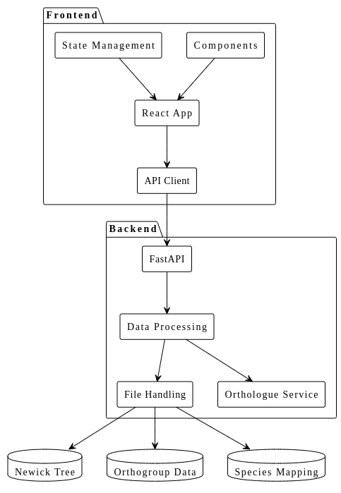

# BioSemanticViz

BioSemanticViz est une plateforme complète pour la visualisation et l'analyse de données biologiques, avec un accent particulier sur les orthologues et les relations phylogénétiques. Elle s'appuie sur des technologies modernes (React, FastAPI, Docker) et intègre la bibliothèque ETE Toolkit (sous licence GPLv3) pour la manipulation et la visualisation d'arbres phylogénétiques.

## Démarrage rapide avec Docker

La manière la plus simple d'utiliser BioSemanticViz est via Docker :

1. Assurez-vous d'avoir Docker et Docker Compose installés
2. Clonez ce dépôt
3. Lancez le script principal :

```bash
./docker-start.sh
```

4. Ouvrez votre navigateur sur http://localhost

---

##  Architecture & Stack technique

### Vue d'ensemble
L'architecture de BioSemanticViz repose sur une approche microservices orchestrée par Docker :

```
+-------------------+        +-------------------+        +-------------------+
|   Frontend (React)| <----> |    Nginx Proxy    | <----> |  Backend (FastAPI)|
+-------------------+        +-------------------+        +-------------------+
        |                        |                        |
        |                        |                        |
        +------------------------+------------------------+
                                 |
                        +-------------------+
                        |   Data/Volumes    |
                        +-------------------+
```

### Composants principaux
- **Frontend** :  React + TypeScript, MUI, D3.js, Axios, React Router, Jest, React Testing Library, Cypress (E2E)  
  **Licence** : MIT
- **Backend** :  FastAPI (Python), Pandas, ETE Toolkit (phylogénie), Biopython, Pytest  
  **Licence** : GPLv3 (à cause d'ETE Toolkit)
- **Reverse Proxy** :  Nginx (pour servir le frontend et router les requêtes API)  
  **Licence** : 2-clause BSD
- **Orchestration** :  Docker & Docker Compose  
  **Licence** : Apache 2.0
- **Données** :  Fichiers Orthogroups, arbres Newick, mapping espèces, etc.



### Architecture du Code
**Frontend**
React App : Point d'entrée de l'application.
Components : Composants réutilisables (ex : boîte de recherche, arbre phylogénétique).
API Client : Gère les appels API vers le backend.
State Management : Gère l'état global de l'application.
**Backend**
FastAPI : Framework backend pour gérer les requêtes HTTP.
Data Processing : Traite les données (ex : recherche d'orthologues, comptage).
File Handling : Gère la lecture des fichiers externes (Newick, orthogroupes, mapping).
Orthologue Service : Service dédié à la logique métier des orthologues.
**Systèmes Externes**
Newick Tree : Fichier d'arbre phylogénétique.
Orthogroup Data : Données d'orthogroupes.
Species Mapping : Fichier de mapping des noms d'espèces.
**Flux de Données**
Le Frontend communique avec le Backend via l'API Client.
Le Backend récupère les données des systèmes externes via le File Handling.
Le Data Processing utilise l'Orthologue Service pour traiter les données.

### Licences des principaux composants
| Composant         | Licence   | Lien                                      |
|-------------------|-----------|-------------------------------------------|
| BioSemanticViz    | GPLv3     | (ce projet, voir LICENSE)                 |
| ETE Toolkit       | GPLv3     | http://etetoolkit.org/                    |
| FastAPI           | MIT       | https://github.com/tiangolo/fastapi       |
| React             | MIT       | https://react.dev/                        |
| D3.js             | BSD-3     | https://d3js.org/                         |
| Nginx             | BSD-2     | https://nginx.org/                        |
| Docker            | Apache 2  | https://www.docker.com/                   |
| Pandas            | BSD-3     | https://pandas.pydata.org/                |
| Biopython         | MIT       | https://biopython.org/                    |

> **Remarque** : L'utilisation d'ETE Toolkit (GPLv3) impose que tout le projet soit distribué sous GPLv3.

BioSemanticViz/
├── README.md
├── ARCHITECTURE.md
├── e2e.sh
├── test.sh
├── tdd.sh
├── docker-compose.yml
├── Dockerfile
├── .gitignore
├── .env
├── jest.config.js
├── pytest.ini
├── frontend/
│   ├── package.json
│   ├── src/
│   │   ├── components/
│   │   │   ├── Header.tsx
│   │   │   ├── Footer.tsx
│   │   │   └── PhylogeneticTreeView.tsx
│   │   ├── pages/
│   │   │   ├── HomePage.tsx
│   │   │   └── UploadPage.tsx
│   │   ├── api/
│   │   │   └── phyloClient.ts
│   │   ├── __tests__/
│   │   │   └── PhylogeneticTreeView.test.tsx
│   │   └── cypress/
│   │       └── e2e/
│   ├── public/
│   └── webpack.config.js
├── backend/
│   ├── requirements.txt
│   ├── app/
│   │   ├── main.py
│   │   ├── api/
│   │   │   └── phylo.py
│   │   ├── models/
│   │   │   ├── Species.py
│   │   │   └── Gene.py
│   │   └── services/
│   │       └── OrthologueService.py
│   └── tests/
│       ├── test_models.py
│       └── test_fastapi.py
├── docs/
│   ├── architecture.puml
│   └── structure.md
├── taxonium-integration/
│   └── taxonium/
│       ├── taxonium_website/
│       ├── taxonium_backend/
│       ├── taxonium_component/
│       └── taxoniumtools/
├── scripts/
│   ├── fix-deps.sh
│   └── dev.sh
├── tests/
│   ├── e2e/
│   ├── unit/
│   └── integration/
└── .github/workflows/
    ├── test.yml
    ├── e2e.yml
    └── python-tests.yml
---

## Installation manuelle

Si vous préférez ne pas utiliser Docker, vous pouvez installer l'application manuellement :

### Installation du backend 

```bash
cd backend
pip install -r requirements.txt
python -m uvicorn app.main:app --reload --host 0.0.0.0 --port 8002
```

### Installation du frontend

```bash
cd frontend
npm install
npm start
```

## Développement
Pour le développement, vous pouvez utiliser le script de développement :

```bash
./dev.sh
```

Cela démarrera le frontend et le backend en mode développement avec rechargement à chaud.

## Tests

Nous utilisons une approche de développement piloté par les tests (TDD). Pour exécuter les tests :

```bash
# Exécuter tous les tests
./run-all-tests.sh

# Exécuter uniquement les tests frontend
cd frontend && npm test

# Exécuter uniquement les tests backend
./python-tests.sh

# Exécuter les tests end-to-end
./e2e.sh

# Démarrer le mode développement TDD (tests en mode watch)
./tdd.sh
```